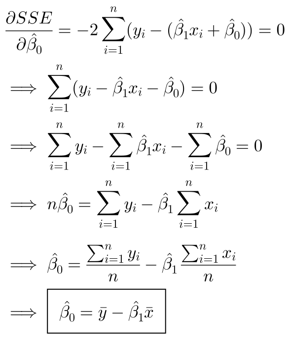
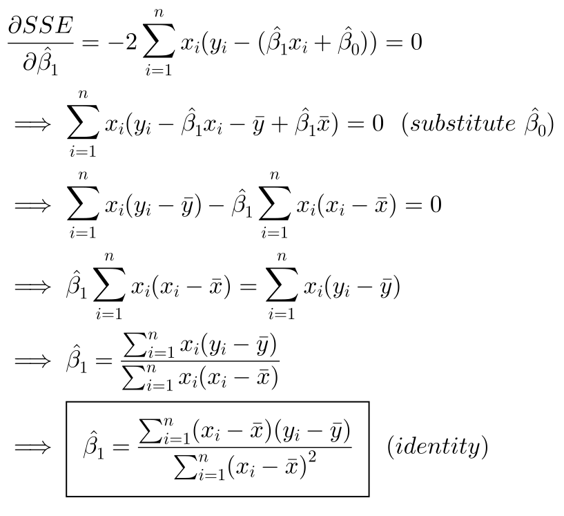
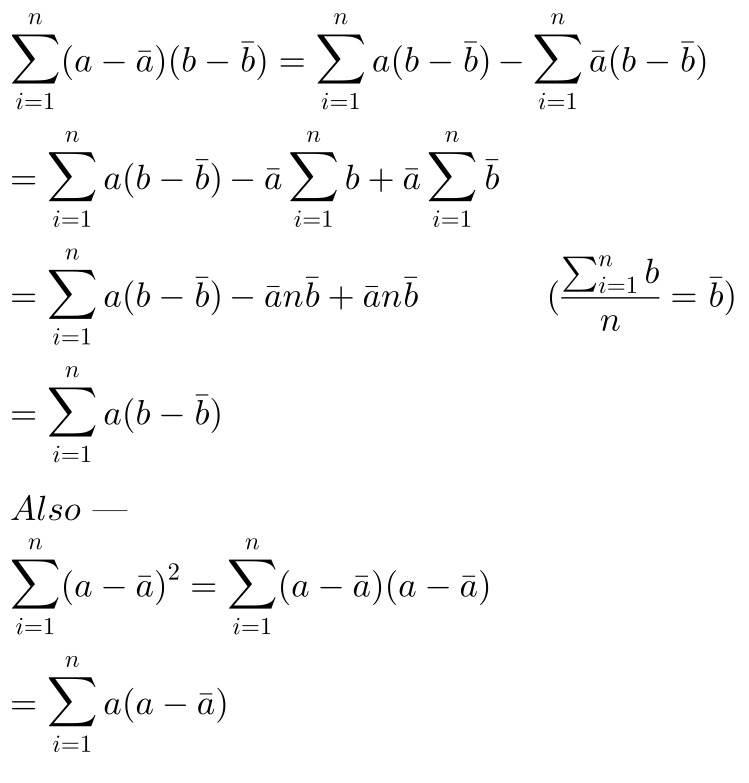
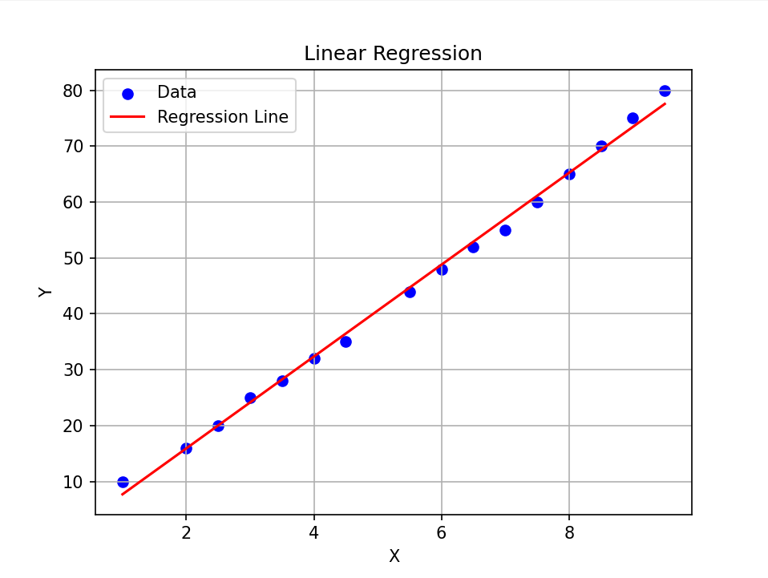

# 📈 Linear Regression From Scratch

This program is my attempt
to create a Linear Regression
model from scratch.

I've used ``numpy`` for the
math to make it efficient and
easy to understand. The error
minimization I've used
**(ordinary least squares)** leads
to the equations used in my
program. Below I talk about all
the math that was done to
understand and recreate it, and
also some other related stuff.

---

## 📑 Math

We have two variables:

- `X`: Independent variable (Input)

- `Y`: Dependant variable (Output)

Simple Linear Regression assumes
that there is approximately a
linear relationship between `X`
and `Y`.

Mathematically, this can be
written as:

**or**

where ß_1 and ß_0 are slope
and intercept respectively,
and ɛ is irreducible error.

We can now give an approximate
prediction equation:

This is our Linear Regression
Model equation.

This prediction, when compared
to real value, gives some error.
The model's goal is to reduce
this error.

The sum of squared error is
given by:

To find the values of ß_1
and ß_0 such that this error
is reduced, we differentiate
the error with respect to
those terms to get the following:

From these, we can solve for
ß_1 and ß_0.

Since we are finding the
minimum SSE with respect to
ß_1 and ß_0, we can take
the respective partial
derivatives as 0.

**Derivation for Intercept**

**Derivation for Slope**

**Identity Equation**

And thus, we have found
our regression coefficients.

---

## 📤 Output

The program has been
implemented to handle
2D dataset (1 dependent and
1 independent).

Below is the visual
showcasing the result.

Thanks for reading this! 😁