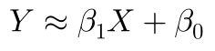
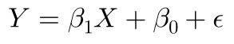
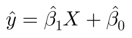
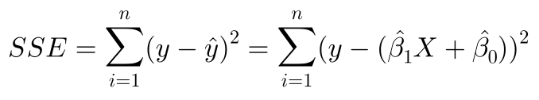

# 📈 Linear Regression From Scratch

This program is my attempt
to create a Linear Regression
model from scratch.

I've used ``numpy`` for the
math to make it efficient and
easy to understand. The error
minimization I've used
**(ordinary least squares)** leads
to the equations used in my
program. Below I talk about all
the math that was done to
understand and recreate it, and
also some other related stuff.

---

### 📑 Math

We have two variables:

- `X`: Independent variable (Input)

- `Y`: Dependant variable (Output)

Simple Linear Regression assumes
that there is approximately a
linear relationship between `X`
and `Y`.

Mathematically, this can be
written as:

**or**

where ß_1 and ß_0 are slope
and intercept respectively,
and ɛ is irreducible error.

We can now give an approximate
prediction equation:

This is our Linear Regression
Model equation.

This prediction, when compared
to real value, gives some error.
The model's goal is to reduce
this error.

The sum of squared error is
given by:

