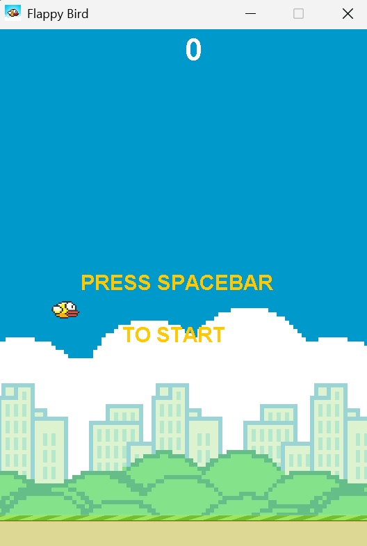
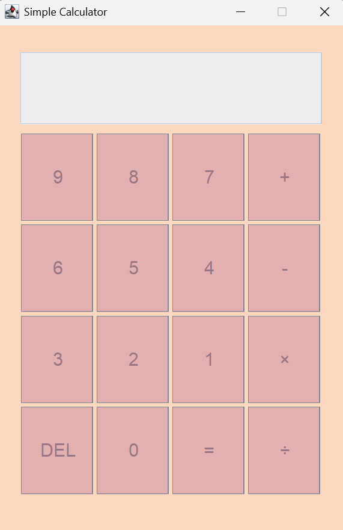

# 📽️ Projects

These are some of the miscellaneous projects I've worked on to have fun, enjoy
and maybe along the path learn something too. 😊

---

## 📑 Content Table

- [Flappy Bird Game](#1-flappy-bird-game)
- [Simple Calculator](#2-simple-calculator)
- [Snake Game](#3-snake-game)
- [License](#-license)

---

These are the projects that I've made (some unfinished which I may finish later 🫣):

### 1. [Flappy Bird Game](/FlappyBirdGame)

A basic and humble Flappy Bird game. My very first coding project which taught me Java and its GUI module `Swing`.
Still has some errors regarding audio and collisions.

### 2. [Simple Calculator](/Calculator)

Given as a program in the OOPS Lab (Java programming), I was kind of unsatisfied with the 'Simple Calculator' 😔.
I decided to take a step further, as I had studied Shunting-Yard algorithm in DSA, I implemented those algorithms
to create a calculator which handles a bit more complex math expressions (still basic arithmetic).

There are still some errors with it, like how when dividing a big number will result in a floating point
number with a huge decimal part, making it unreadable (technically value is correct).

### 3. [Snake Game](/SnakeGame)

Another game because why not? 🤷

Simple Snake Game using Python. Nothing much to say except it having some bugs too... 😅

---

## 📄 License

This project is licensed under the [MIT License](https://opensource.org/licenses/MIT) — feel free to use and modify for your use!

---

Made with love💖, fun🕹️ and creativity🌈 by [Justin17727](https://github.com/Justin17727)